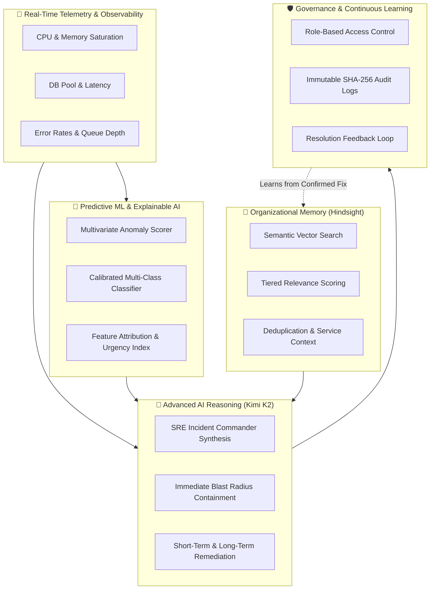

# 🚨 Hindsight · Next-Gen SRE Incident Intelligence & Predictive Platform

> **An AI-powered Site Reliability Engineering (SRE) command center combining real-time telemetry streaming, Explainable Machine Learning failure prediction, Moonshot AI Kimi K2 reasoning, and persistent organizational memory via Hindsight.**

[](https://www.python.org/)
[](https://streamlit.io/)
[-8A2BE2.svg)](https://openrouter.ai/)
[](https://hindsight.vectorize.io/)
[](https://scikit-learn.org/)
[]()
[](LICENSE)

---

## 🎯 The SRE Challenge

Modern production environments suffer from recurring outages and institutional memory loss:

1. **Repetitive Production Incidents**: 70%+ of production outages share underlying patterns with previously resolved incidents (connection pool exhaustion, memory leaks, saturation cascades).
2. **Scattered Organizational Knowledge**: Postmortems, incident logs, Slack threads, and runbooks are siloed across disconnected tools.
3. **Reactive Firefighting**: Teams only respond after alerts fire, rather than detecting multivariate telemetry anomalies before SLA breaches occur.
4. **Tribal Knowledge Dependency**: Senior engineers possess domain intuition that junior responders lack during high-pressure outages.

---

## 💡 The Solution

**Hindsight SRE Intelligence Platform** unifies proactive machine learning with deep historical context:



---

## 🌟 Core Architecture & Key Features

### 1. 🔮 Explainable ML Failure Predictor
- **Multi-Class Classifier**: Trained on telemetry vectors across 7 operational archetypes:
  - `Database Connection Exhaustion`
  - `CPU Saturation`
  - `Memory Exhaustion & Leaks`
  - `Network Degradation`
  - `API Availability Degradation`
  - `Disk Exhaustion`
  - `Healthy Baseline`
- **Explainable AI (XAI)**: Quantifies driving telemetry metrics and flags warning/critical threshold breaches.
- **Dynamic Risk Windows**: Calculates time-to-failure urgency index (e.g., `< 3 minutes: Immediate Breach Imminent`).

### 2. 🧠 Persistent Organizational Memory (Hindsight)
- **Semantic Vector Recall**: Automatically searches historical incident postmortems using semantic similarity.
- **Multi-Tiered Relevance Engine**: Ranks historical incidents into `High Relevance (>=75%)`, `Moderate (50-74%)`, and `Contextual (<50%)`.
- **Closed-Loop Learning**: When engineers verify and resolve an incident, the resolution is automatically synthesized and ingested back into Hindsight.

### 3. 🤖 Moonshot AI Kimi K2 Reasoning Engine
- Uses **Moonshot AI Kimi K2** via OpenRouter for high-depth SRE reasoning.
- Synthesizes telemetry signals, ML anomaly attributions, and historical memories into:
  - **Severity Assessment** (`P1` - `P4`)
  - **Root Cause Analysis** with confidence metrics
  - **Immediate Containment** (actions within 5 minutes)
  - **Short-Term Remediation** (actions within 30 minutes)
  - **Long-Term Architectural Hardening**
  - **Explicit Uncertainty & Evidence Boundaries**

### 4. 🛡️ Enterprise Security & Governance
- **Role-Based Access Control (RBAC)**: Supports Lead SRE, Platform Ops, and Viewer roles with bcrypt password hashing.
- **Immutable Audit Logging**: Every query, memory update, and resolution is hashed and logged to `data/audit_logs.json`.

### 5. 🎛️ Command Center UI
- High-aesthetic dark-mode dashboard built with Streamlit and modern CSS.
- Interactive telemetry simulator with real-time signal controls and scenario presets.
- Live failure risk gauge, telemetry heatmaps, and past resolution inspector.

---

## 📁 Repository Structure

```
hindsight-incident-response-agent/
├── app/
│   ├── agent.py               # IncidentResponseAgent orchestration engine
│   ├── auth.py                # RBAC & SHA-256 audit log manager
│   ├── failure_predictor.py   # Scikit-learn ML predictor & XAI attribution
│   ├── hindsight_memory.py    # Hindsight vector client wrapper
│   ├── incident_history.py    # Local incident tracking & lifecycle
│   ├── llm.py                 # Moonshot AI Kimi K2 reasoning engine
│   ├── memory_engine.py       # Multi-tier memory ranking & deduplication
│   ├── telemetry_manager.py   # Global telemetry state manager
│   ├── telemetry_simulator.py # Real-time synthetic telemetry generator
│   └── train_predictor.py     # ML training & validation pipeline
├── data/
│   ├── audit_logs.json        # Immutable governance audit records
│   ├── failure_predictor.joblib # Calibrated ML model artifact
│   ├── failure_predictor_metrics.json # Model training metrics
│   ├── incidents.json         # Seed incident repository
│   ├── telemetry_dataset.csv  # Telemetry training dataset
│   └── users.json             # RBAC user credentials store
├── tests/
│   ├── test_agent.py          # End-to-end incident investigation test
│   ├── test_failure_predictor.py # ML classifier validation suite
│   ├── test_groq.py           # LLM reasoning & schema validation test
│   ├── test_hindsight.py      # Hindsight vector client recall test
│   └── test_learning.py       # Resolution learning loop test
├── .env.example               # Configuration template
├── main.py                    # Streamlit SRE Command Center application
├── load_incidents.py          # Seed incident data loader
├── requirements.txt           # Python package dependencies
└── README.md                  # System documentation
```

---

## ⚡ Quickstart Guide

### 1. Prerequisites
- Python `3.11+`
- Hindsight API Key ([Vectorize Hindsight](https://hindsight.vectorize.io/))
- OpenRouter API Key ([OpenRouter](https://openrouter.ai/keys))

### 2. Clone & Setup Virtual Environment
```bash
git clone https://github.com/Tejwin-linto-ee/hindsight-incident-response-agent.git
cd hindsight-incident-response-agent

# Create and activate virtual environment
python -m venv venv
# On Windows:
.\venv\Scripts\activate
# On Linux/macOS:
source venv/bin/activate

# Install dependencies
pip install -r requirements.txt
```

### 3. Configure Environment Variables
Copy `.env.example` to `.env` and fill in your keys:
```env
HINDSIGHT_API_KEY=your_hindsight_api_key_here
HINDSIGHT_BASE_URL=https://api.hindsight.vectorize.io
HINDSIGHT_BANK_ID=incident-response
OPENROUTER_API_KEY=your_openrouter_api_key_here
```

### 4. Load Seed Incidents into Hindsight
```bash
python load_incidents.py
```

### 5. Launch the Command Center UI
```bash
streamlit run main.py
```
Open `http://localhost:8501` in your browser. Default demo credentials:
- **Admin**: `admin` / `admin123`
- **Ops**: `supriya` / `supriya123`

---

## 🧪 Automated Testing

Execute the comprehensive test suite with Pytest:

```bash
# Run full automated test suite
pytest

# Test ML predictor across all failure archetypes
python test_failure_predictor.py
```

---

## 🔒 Security & Privacy

- **No Hardcoded Secrets**: Secrets are loaded securely via `.env`.
- **Sensitive Memory Scrubbing**: Historical memories are sanitized before reasoning ingestion.
- **Audit Compliance**: All resolution overrides and memory updates require authenticated SRE identity.

---

## 📄 License

This project is licensed under the MIT License - see the [LICENSE](LICENSE) file for details.
