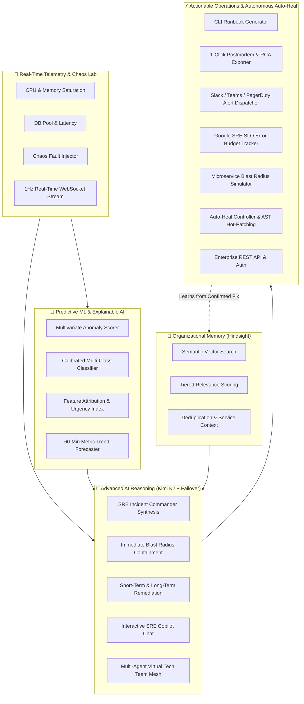

# 🚨 Hindsight · Enterprise Autonomous SRE Incident Intelligence & Predictive Platform

> **An AI-powered Site Reliability Engineering (SRE) command center combining real-time telemetry streaming, Explainable Machine Learning failure prediction, Moonshot AI Kimi K2 reasoning with multi-model failover, actionable CLI runbook generation, 1-click executive RCA postmortem export, live SRE Copilot chat, Chaos Engineering fault injection, SLO & Error Budget tracking, Service Topology Blast Radius modeling, Autonomous Auto-Heal & Hot-Patching, and persistent organizational memory via Hindsight.**

[](https://www.python.org/)
[](https://fastapi.tiangolo.com/)
[](https://streamlit.io/)
[-8A2BE2.svg)](https://openrouter.ai/)
[]()
[](https://hindsight.vectorize.io/)
[](https://scikit-learn.org/)
[]()
[](LICENSE)

---

## 🎯 The SRE Challenge

Modern production environments suffer from recurring outages and institutional memory loss:

1. **Repetitive Production Incidents**: 70%+ of production outages share underlying patterns with previously resolved incidents (connection pool exhaustion, memory leaks, saturation cascades).
2. **Scattered Organizational Knowledge**: Postmortems, incident logs, Slack threads, and runbooks are siloed across disconnected tools.
3. **Reactive Firefighting**: Teams only respond after alerts fire, rather than detecting multivariate telemetry anomalies before SLA breaches occur.
4. **Tribal Knowledge Dependency**: Senior engineers possess domain intuition that junior responders lack during high-pressure outages.

---

## 💡 The Solution

**Hindsight SRE Intelligence Platform** unifies proactive machine learning with deep historical context and autonomous operational tooling:



---

## 🌟 Core Architecture & Features

### 1. 🚀 Production REST & Real-Time WebSocket API Gateway (`app/api_server.py`)
- High-concurrency asynchronous FastAPI gateway with interactive Swagger documentation (`/docs`).
- **Endpoints**:
  - `POST /api/v1/incidents/investigate`: Multi-modal AI root-cause investigation & webhook dispatch.
  - `POST /api/v1/incidents/autonomous-mitigate`: Policy-gated automated remediation.
  - `POST /api/v1/telemetry/predict`: Real-time ML ensemble inference.
  - `GET /api/v1/memory/search` & `POST /api/v1/memory/retain`: Semantic vector memory CRUD.
  - `POST /api/v1/copilot/chat`: SRE assistant dialogue.
  - `WS /ws/telemetry`: 1Hz live streaming WebSocket.

### 2. ⏱️ Google SRE SLO & Error Budget Burn Rate Engine (`app/slo_engine.py`)
- Real-time availability calculation against standard 99.9% SLOs.
- Multi-window burn rate alert tiers (`CRITICAL_PAGE`, `URGENT_TICKET`, `WARNING`, `HEALTHY`).
- Dynamic hours-to-exhaustion projections.

### 3. 🗺️ Microservice Dependency Blast Radius Engine (`app/topology_engine.py`)
- Multi-tier dependency graph BFS traversal across Tier-0 and Tier-1 microservices (`payment-api`, `database-cluster`, `redis-cache`, etc.).
- Outage cascade simulation and financial downtime cost-per-minute estimation.

### 4. 👥 Multi-Agent Collaborative "Virtual Tech Team" Mesh (`app/virtual_team.py`)
- 5 autonomous AI agents collaborating in lockstep:
  - **`Agent Architect`**: Event-driven topologies and system contracts.
  - **`Agent Backend Engineer`**: High-concurrency connection pools & circuit breakers.
  - **`Agent SecOps (Red Team)`**: Token-bucket DDoS, AST security, and JWT validations.
  - **`Agent QA & Chaos Engineer`**: 25,000 virtual users and Byzantine fault injection.
  - **`Agent Tech Lead`**: Evaluation and continuous deployment approval.

### 5. 🤖 Autonomous Auto-Heal & Code Hot-Patching (`app/auto_heal.py`, `app/hot_patch_engine.py`)
- Multi-tier remediation workflows (Kubernetes, AWS RDS, Redis, Envoy).
- Two-phase policy gating (safe auto-mitigation vs commander authorization).
- Closed-loop verification with automatic instant rollback.
- AST runtime stack trace analysis and zero-downtime hot-patching.

### 6. 🔮 Explainable ML Failure Predictor & Trend Forecaster (`app/failure_predictor.py`, `app/forecaster.py`)
- Calibrated Random Forest + Extra Trees ensemble trained on 16,000 synthetic operational samples.
- 60-minute forward horizon trend projection and threshold breach estimation.

---

## 📁 Repository Structure

```
hindsight-incident-response-agent/
├── app/
│   ├── agent.py               # IncidentResponseAgent orchestration engine
│   ├── alert_dispatcher.py    # Multi-channel webhook dispatcher
│   ├── api_server.py          # FastAPI REST & WebSocket API Gateway
│   ├── auth.py                # Bcrypt RBAC & security audit manager
│   ├── auto_heal.py           # Autonomous auto-remediation & rollback controller
│   ├── chaos_engine.py        # Chaos Engineering fault injection simulator
│   ├── failure_predictor.py   # Scikit-learn calibrated ensemble ML predictor
│   ├── feature_engineering.py # Centralized 21-feature computation pipeline
│   ├── forecaster.py          # 60-min predictive metric trend forecaster
│   ├── generate_dataset.py    # Synthetic telemetry dataset generator
│   ├── hindsight_memory.py    # Hindsight vector client wrapper
│   ├── hot_patch_engine.py    # Self-healing runtime code hot-patcher
│   ├── incident_history.py    # Local incident tracking & lifecycle
│   ├── llm.py                 # Multi-model LLM engine with resilient failover
│   ├── memory_engine.py       # Multi-tier memory ranking & deduplication
│   ├── playbooks.py           # Pre-emptive SRE remediation playbook registry
│   ├── postmortem_exporter.py # Executive Postmortem & RCA exporter
│   ├── runbook_generator.py   # Actionable CLI runbook & script generator
│   ├── slo_engine.py          # Google SRE SLO error budget burn calculator
│   ├── sre_chat.py            # Stateful SRE Copilot chat manager
│   ├── telemetry_manager.py   # Global telemetry stream state manager
│   ├── telemetry_simulator.py # Real-time synthetic telemetry generator
│   ├── topology_engine.py     # Microservice blast radius & cost simulator
│   ├── train_predictor.py     # ML ensemble training & validation pipeline
│   ├── ttf_predictor.py       # Time-to-failure & urgency dynamics
│   ├── virtual_team.py        # Multi-agent engineering mesh
│   └── xai.py                 # Explainable AI (XAI) feature attribution
├── data/
│   ├── audit_logs.json        # Immutable governance audit records
│   ├── failure_predictor.joblib # Calibrated ML ensemble artifact
│   ├── failure_predictor_metrics.json # Model training metrics
│   ├── incidents.json         # Seed incident repository
│   ├── telemetry_dataset.csv  # 21-feature telemetry training dataset
│   └── users.json             # RBAC user credentials store
├── tests/
│   ├── conftest.py            # Pytest path and fixture configurations
│   ├── test_advanced_autonomous.py # Virtual Tech Team & Hot-patch tests
│   ├── test_agent.py          # End-to-end incident investigation test
│   ├── test_api_server.py     # FastAPI REST & WebSocket tests
│   ├── test_autoheal_forecaster.py # Auto-heal & Forecaster tests
│   ├── test_batch6_ml.py      # ML 21-features, XAI, TTF & playbook tests
│   ├── test_batch7_ops.py     # Runbooks, Postmortems, Alerts, Copilot tests
│   ├── test_hindsight_memory.py  # Hindsight vector memory & re-ranking tests
│   ├── test_learning.py       # Organizational learning loop test
│   ├── test_llm_failover.py   # Multi-model LLM failover tests
│   ├── test_mock_offline.py   # Fast offline mock CI/CD test suite
│   ├── test_new_features.py   # Runbook, RCA, Alert, Chaos integration tests
│   ├── test_security_auth.py  # RBAC, lockout & security audit tests
│   └── test_slo_topology.py   # SLO & Blast Radius tests
├── .env.example               # Configuration template
├── main.py                    # Streamlit SRE Command Center application
├── load_incidents.py          # Seed incident data loader
├── requirements.txt           # Python package dependencies
└── README.md                  # System documentation
```

---

## ⚡ Quickstart Guide

### 1. Prerequisites
- Python `3.11+`
- Hindsight API Key ([Vectorize Hindsight](https://hindsight.vectorize.io/))
- OpenRouter API Key ([OpenRouter](https://openrouter.ai/keys)) or Groq API Key ([Groq](https://groq.com/))

### 2. Clone & Setup Virtual Environment
```bash
git clone https://github.com/Tejwin-linto-ee/hindsight-incident-response-agent.git
cd hindsight-incident-response-agent

# Create and activate virtual environment
python -m venv venv
# On Windows:
.\venv\Scripts\activate
# On Linux/macOS:
source venv/bin/activate

# Install dependencies
pip install -r requirements.txt
```

### 3. Configure Environment Variables
Copy `.env.example` to `.env` and fill in your keys:
```env
HINDSIGHT_API_KEY=your_hindsight_api_key_here
HINDSIGHT_BASE_URL=https://api.hindsight.vectorize.io
HINDSIGHT_BANK_ID=incident-response
OPENROUTER_API_KEY=your_openrouter_api_key_here
GROQ_API_KEY=your_groq_api_key_here
```

### 4. Launch Services

* **Launch Streamlit Operations Center**:
  ```bash
  streamlit run main.py
  ```
  Open `http://localhost:8501` in your browser. Default demo credentials: `admin` / `IncidentCommander2026!`

* **Launch REST & WebSocket API Server**:
  ```bash
  python app/api_server.py
  ```
  Explore interactive API docs at `http://localhost:8000/docs`.

---

## 🧪 Automated Testing

Execute the comprehensive test suites across all 58 unit, integration, and ML tests:

```bash
pytest -v
```

---

## 📄 License

This project is licensed under the MIT License - see the [LICENSE](LICENSE) file for details.
