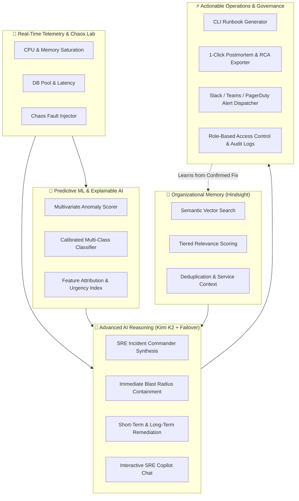

# 🚨 Hindsight · Enterprise SRE Incident Intelligence & Predictive Platform

> **An AI-powered Site Reliability Engineering (SRE) command center combining real-time telemetry streaming, Explainable Machine Learning failure prediction, Moonshot AI Kimi K2 reasoning with multi-model failover, actionable CLI runbook generation, 1-click executive RCA postmortem export, live SRE Copilot chat, Chaos Engineering fault injection, and persistent organizational memory via Hindsight.**

[](https://www.python.org/)
[](https://streamlit.io/)
[-8A2BE2.svg)](https://openrouter.ai/)
[]()
[](https://hindsight.vectorize.io/)
[](https://scikit-learn.org/)
[]()
[](LICENSE)

---

## 🎯 The SRE Challenge

Modern production environments suffer from recurring outages and institutional memory loss:

1. **Repetitive Production Incidents**: 70%+ of production outages share underlying patterns with previously resolved incidents (connection pool exhaustion, memory leaks, saturation cascades).
2. **Scattered Organizational Knowledge**: Postmortems, incident logs, Slack threads, and runbooks are siloed across disconnected tools.
3. **Reactive Firefighting**: Teams only respond after alerts fire, rather than detecting multivariate telemetry anomalies before SLA breaches occur.
4. **Tribal Knowledge Dependency**: Senior engineers possess domain intuition that junior responders lack during high-pressure outages.

---

## 💡 The Solution

**Hindsight SRE Intelligence Platform** unifies proactive machine learning with deep historical context and autonomous operational tooling:



---

## 🌟 Core Features

### 1. 🔮 Explainable ML Failure Predictor
- **Multi-Class Classifier**: Trained on telemetry vectors across 7 operational archetypes:
  - `Database Connection Exhaustion`
  - `CPU Saturation`
  - `Memory Exhaustion & Leaks`
  - `Network Degradation`
  - `API Availability Degradation`
  - `Disk Exhaustion`
  - `Healthy Baseline`
- **Explainable AI (XAI)**: Quantifies driving telemetry metrics and flags warning/critical threshold breaches.
- **Dynamic Risk Windows**: Calculates time-to-failure urgency index (e.g., `< 3 minutes: Immediate Breach Imminent`).

### 2. ⚡ Actionable Runbooks & CLI Patch Generator
- Automatically generates copy-pasteable CLI commands (`kubectl`, `psql`, `aws`, `systemctl`, `docker`) tailored to the diagnosed failure archetype.
- Includes pre-flight safety checks, blast radius estimates, and automated rollback commands.

### 3. 📑 1-Click Executive Postmortem & RCA Exporter
- Exports formal Postmortem (Root Cause Analysis - RCA) reports in **Markdown (`.md`)** and **JSON (`.json`)** formats ready for Jira, Confluence, and engineering leadership.
- Includes Five-Whys root cause decomposition, incident timeline, and preventative engineering action items.

### 4. 💬 Interactive Multi-Turn SRE Copilot Chat
- Embedded conversational copilot allowing responders to ask follow-up questions during active outages:
  - *"What are the risks of scaling the worker pool right now?"*
  - *"How did the team resolve the similar INC-042 incident last quarter?"*

### 5. 📢 Real-Time Alert Dispatcher
- Dispatches rich alert cards directly to **Slack (Block Kit)**, **Microsoft Teams (MessageCard)**, and **PagerDuty / Opsgenie** webhooks with 1-click test triggers.

### 6. 💥 Chaos Engineering Fault Injection Lab
- 5 built-in chaos scenarios to stress-test your monitoring and automated response:
  - *Cascading Database Deadlock Storm*
  - *Linear Memory Leak & Heap Creep*
  - *Flash Traffic Surge & CPU Saturation*
  - *Inter-AZ Network Congestion & Latency Spike*
  - *Runaway WAL / Debug Log Disk Exhaustion*

### 7. 🔄 Resilient Multi-Model LLM Failover
- **Primary**: `moonshotai/kimi-k2` (OpenRouter)
- **Fallback 1**: `meta-llama/llama-3.3-70b-instruct` / `deepseek/deepseek-chat` (OpenRouter)
- **Fallback 2**: Native Groq API (`llama-3.3-70b-versatile`)

### 8. 🛡️ Enterprise Security & Governance
- **Role-Based Access Control (RBAC)**: Supports Lead SRE, Platform Ops, and Viewer roles with bcrypt password hashing.
- **Immutable Audit Logging**: Every query, memory update, and resolution is hashed and logged to `data/audit_logs.json`.

---

## 📁 Repository Structure

```
hindsight-incident-response-agent/
├── app/
│   ├── agent.py               # IncidentResponseAgent orchestration engine
│   ├── alert_dispatcher.py    # Slack, Teams, PagerDuty, Opsgenie dispatcher
│   ├── auth.py                # Zero-Trust RBAC & SHA-256 audit log manager
│   ├── chaos_engine.py        # Safe Chaos Engineering fault injection simulator
│   ├── failure_predictor.py   # Scikit-learn calibrated ensemble ML predictor
│   ├── feature_engineering.py # Centralized 19-feature computation pipeline
│   ├── hindsight_memory.py    # Hindsight vector client wrapper
│   ├── incident_history.py    # Local incident tracking & lifecycle
│   ├── llm.py                 # Multi-model LLM engine with resilient failover
│   ├── memory_engine.py       # Multi-tier memory ranking & deduplication
│   ├── playbooks.py           # Pre-emptive SRE remediation playbook registry
│   ├── postmortem_exporter.py # Executive Postmortem & RCA exporter
│   ├── runbook_generator.py   # Actionable CLI runbook & script generator
│   ├── sre_chat.py            # Stateful SRE Copilot chat manager
│   ├── telemetry_manager.py   # Global telemetry stream state manager
│   ├── telemetry_simulator.py # Real-time synthetic telemetry generator
│   ├── train_predictor.py     # ML training & validation pipeline
│   ├── ttf_predictor.py       # Time-to-failure & urgency dynamics
│   └── xai.py                 # Explainable AI (XAI) feature attribution
├── data/
│   ├── audit_logs.json        # Immutable governance audit records
│   ├── failure_predictor.joblib # Calibrated ML ensemble artifact
│   ├── failure_predictor_metrics.json # Model training metrics
│   ├── incidents.json         # Seed incident repository
│   ├── telemetry_dataset.csv  # 19-feature telemetry training dataset
│   └── users.json             # RBAC user credentials store
├── tests/
│   ├── conftest.py            # Pytest path and fixture configurations
│   ├── test_agent.py          # End-to-end incident investigation test
│   ├── test_batch6_ml.py      # ML 19-features, XAI, TTF & playbook tests
│   ├── test_batch7_ops.py     # Runbooks, Postmortems, Alerts, Copilot tests
│   ├── test_failure_predictor.py # Failure predictor regression test suite
│   ├── test_hindsight_memory.py  # Hindsight vector memory & re-ranking tests
│   ├── test_learning.py       # Organizational learning loop test
│   ├── test_llm_failover.py   # Multi-model LLM failover tests
│   ├── test_mock_offline.py   # Fast offline mock CI/CD test suite
│   ├── test_new_features.py   # Runbook, RCA, Alert, Chaos integration tests
│   └── test_security_auth.py  # RBAC, lockout & security audit tests
├── .env.example               # Configuration template
├── main.py                    # Streamlit SRE Command Center application
├── load_incidents.py          # Seed incident data loader
├── requirements.txt           # Python package dependencies
└── README.md                  # System documentation
```

---

## ⚡ Quickstart Guide

### 1. Prerequisites
- Python `3.11+`
- Hindsight API Key ([Vectorize Hindsight](https://hindsight.vectorize.io/))
- OpenRouter API Key ([OpenRouter](https://openrouter.ai/keys)) or Groq API Key ([Groq](https://groq.com/))

### 2. Clone & Setup Virtual Environment
```bash
git clone https://github.com/Tejwin-linto-ee/hindsight-incident-response-agent.git
cd hindsight-incident-response-agent

# Create and activate virtual environment
python -m venv venv
# On Windows:
.\venv\Scripts\activate
# On Linux/macOS:
source venv/bin/activate

# Install dependencies
pip install -r requirements.txt
```

### 3. Configure Environment Variables
Copy `.env.example` to `.env` and fill in your keys:
```env
HINDSIGHT_API_KEY=your_hindsight_api_key_here
HINDSIGHT_BASE_URL=https://api.hindsight.vectorize.io
HINDSIGHT_BANK_ID=incident-response
OPENROUTER_API_KEY=your_openrouter_api_key_here
GROQ_API_KEY=your_groq_api_key_here
```

### 4. Load Seed Incidents into Hindsight
```bash
python load_incidents.py
```

### 5. Launch the Command Center UI
```bash
streamlit run main.py
```
Open `http://localhost:8501` in your browser. Default demo credentials:
- **Admin**: `admin` / `admin123`
- **Ops**: `supriya` / `supriya123`

---

## 🧪 Automated Testing

Execute the comprehensive test suites across all components:

```bash
# 1. Run full test suite (37 unit & integration tests)
pytest tests/ -v

# 2. Run specific batch tests
pytest tests/test_batch6_ml.py -v
pytest tests/test_batch7_ops.py -v
pytest tests/test_security_auth.py -v
pytest tests/test_llm_failover.py -v
```

---

## 🔒 Security & Privacy

- **No Hardcoded Secrets**: Secrets are loaded securely via `.env`.
- **Sensitive Memory Scrubbing**: Historical memories are sanitized before reasoning ingestion.
- **Audit Compliance**: All resolution overrides, chaos injections, and memory updates require authenticated SRE identity and are logged in SHA-256 audit trails.

---

## 📄 License

This project is licensed under the MIT License - see the [LICENSE](LICENSE) file for details.
